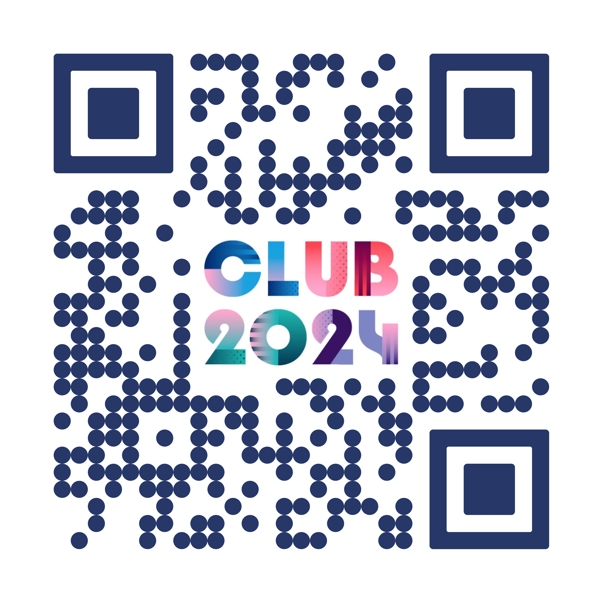
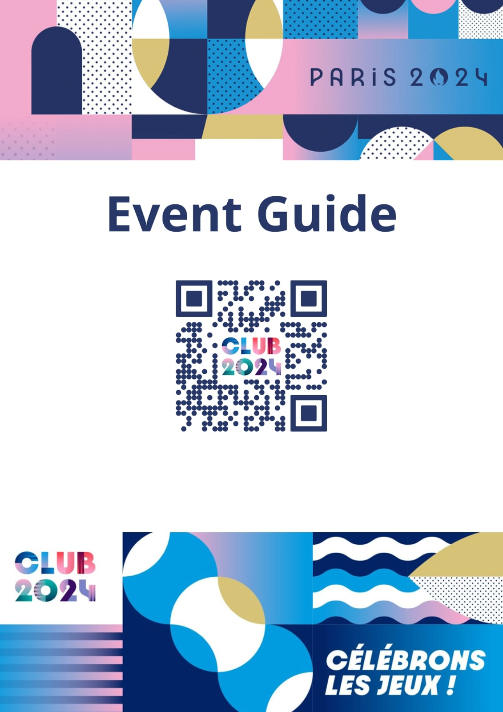

# Event Guide - Créteil Beach Handball

  

## Overview

This project is a web-based event guide for the Créteil Beach Handball event, part of the Paris 2024 Olympics celebration. It provides details on activities scheduled for the day, with an interactive layout that uses collapsible sections to display event information.

## Features

- **Event Schedule**: Displays activities categorized by full-day and partial-day events.
- **Interactive Tables**: Uses accordion-style buttons to reveal detailed schedules.
- **Responsive Design**: Adapts to various screen sizes for optimal viewing on mobile and desktop devices.
- **Dynamic Content**: Populates event details using JavaScript, making it easy to update and maintain.

## Contributing

If you want to contribute to this project, please follow these steps:

1. **Fork the Repository**: Create a personal copy of the project.
2. **Make Changes**: Implement your changes in a new branch.
3. **Submit a Pull Request**: Propose your changes to be merged into the main repository.

## License

This project is licensed under the MIT License. See the [LICENSE](LICENSE) file for details.

## Contact

For questions or feedback, please contact us at [info@paris2024club.org](mailto:prs.online.00@gmail.com)

  

---

<i>Enjoy the Créteil Beach Handball event and celebrate the spirit of the Paris 2024 Olympics!</i>

